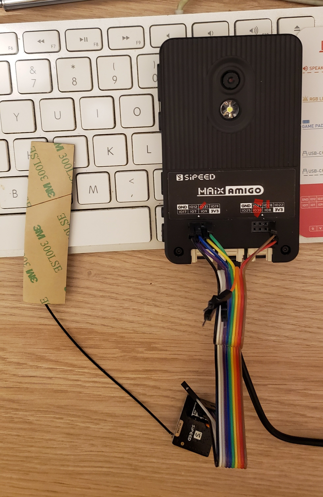

# Mi_Amigo

A collection of MaixPy scripts and libraries for the [Maix Amigo](https://wiki.sipeed.com/soft/maixpy/en/develop_kit_board/maix_amigo.html). While this board is focused on AI, especially computer vision (and seems to be be quite good at it), I bought, and am using, this board as a portable IOT device. 480x320 TFT, SD card, expansion ports, fast! What else could I wish for?

There are a bunch of MaixPy scripts and libraries [here](https://github.com/sipeed/MaixPy_scripts), but they are not very well documented, and most are not specifically for the Amigo. So I am looking at stuff there, and augmenting, fixing, rewriting...

The first issue was connectivity: the 2 SP-MOD connectors at the back have pins that are already in use. So I had to hack something together:



## sx127x.py

The original library doesn't work for the Amigo – wrong pinouts – and is not very well written. So I made it work for my device, and added a bunch of functions, while fixing stuff.

### setFrequency

I fixed that function, which accepted only a small set of frequencies. I made it more versatile.

```python
    def setFrequency(self, frequency):
        self._frequency = frequency
        #frfs = {169E6: (42, 64, 0),
        #        433E6: (108, 64, 0),
        #        434E6: (108, 128, 0),
        #        866E6: (216, 128, 0),
        #        868E6: (217, 0, 0),
        #        915E6: (228, 192, 0)}
        # that's stupid and lazy.
        # Enable all and any frequency
        #FXOSC = 32000000.0
        #FSTEP = (FXOSC / 524288)
        # 61.03516
        frf = int(frequency / 61.03516)
        self.writeRegister(REG_FRF_MSB, (frf >> 16) & 0xff)
        self.writeRegister(REG_FRF_MID, (frf >> 8) & 0xff)
        self.writeRegister(REG_FRF_LSB, frf & 0xff)
```

### setSignalBandwidth

You can now set BW either by frequency (say 125e3 for 125 KHz), or by number (BW 7 = 125 KHz). 500 KHz was missing too, so I added it.

### getXXXX

There were no functions to enquire about current settings – which sucked major goat balls. We now have:

* getTxPower(self):
* getFrequency(self):
* getSpreadingFactor(self):
* getSignalBandwidth(self):
* getCodingRate(self):
* getPreambleLength(self):
* getSyncWord(self):

I'm planning to add a decent `dumpRegisters` function, based on my C++ code in [LoRaStuff.h](https://github.com/Kongduino/Lora_Stuff/blob/master/LoRa_Stuff.h#L143).

## LoRa_Tester.py

This sample app builds a touch-screen menu that allows me to do some basic LoRa distance tests. I'm planning to add at some point a GPS module, so that I can calculate the distance, with the Haversine formula. The app itself works well enough, and can send PINGs, and displays incoming messages withh RSSI and SNR.

### camera_test.py

This small script acquires continuously a 320x240 photo and displays it, while printing the fps in the serial terminal.